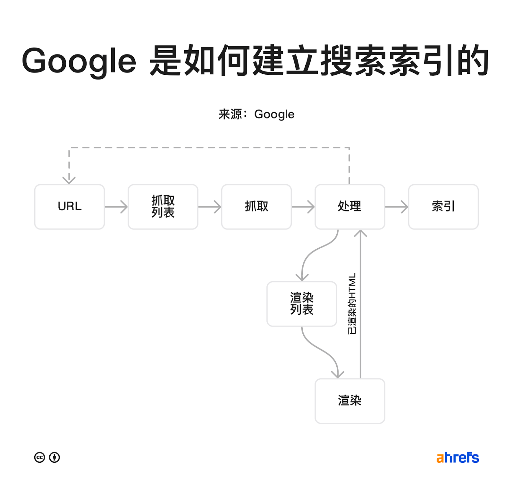

SEO也要考虑搜索引擎和用户会怎样找你的网站。因此你的关键词也应该去匹配

https://ahrefs.com/blog/zh/how-do-search-engines-work/

分解之后就是：

1. URL
2. 抓取
3. 处理 & 渲染
4. 索引

Google 已经有一个包含数万亿个网页的索引库。如果某人在这些页面中添加了一个链接指向了自己的网站，那么 Google 可以从那些页面中找到链接。

1.多让其他网站放入你的链接

2.将网站地图提交给google

3.来自 URL 提交。Google 还允许通过 Google Search Console 提交单个 URL。

#### 链接相关性对SEO影响很大

→可以在各个播客的shownotes和评论中放入链接

### 相关性

谷歌会注意搜索词与网页之间的相关性。

### 新鲜度

新鲜度是基于搜索词的排名因素。

### 话题权威性

Google 希望对具有该话题权威的网站的内容进行排名。这意味着 Google 可能会将网站本生视为评价搜索结果质量的标准。 

### 页面速度

### 移动端友好

65％ 的 Google [搜索发生在移动设备上](https://www.seroundtable.com/google-mobile-searches-now-65-of-all-searches-28003.html)。因此，自2015年以来，移动设备友好性就成为移动设备搜索排名的一个重要因素。
